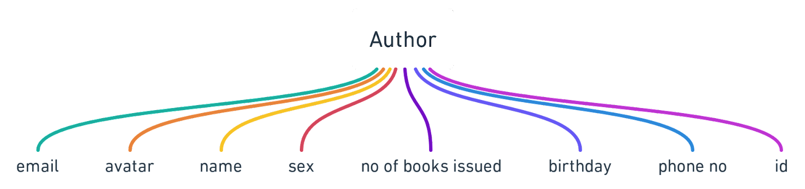
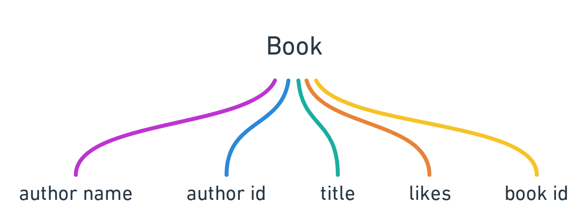
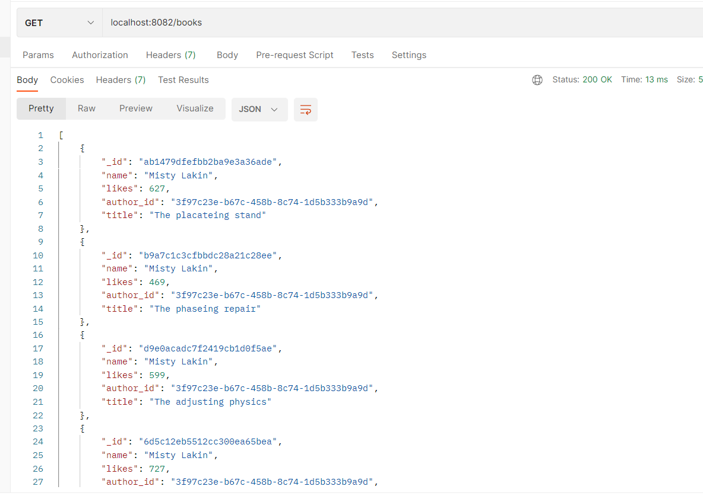
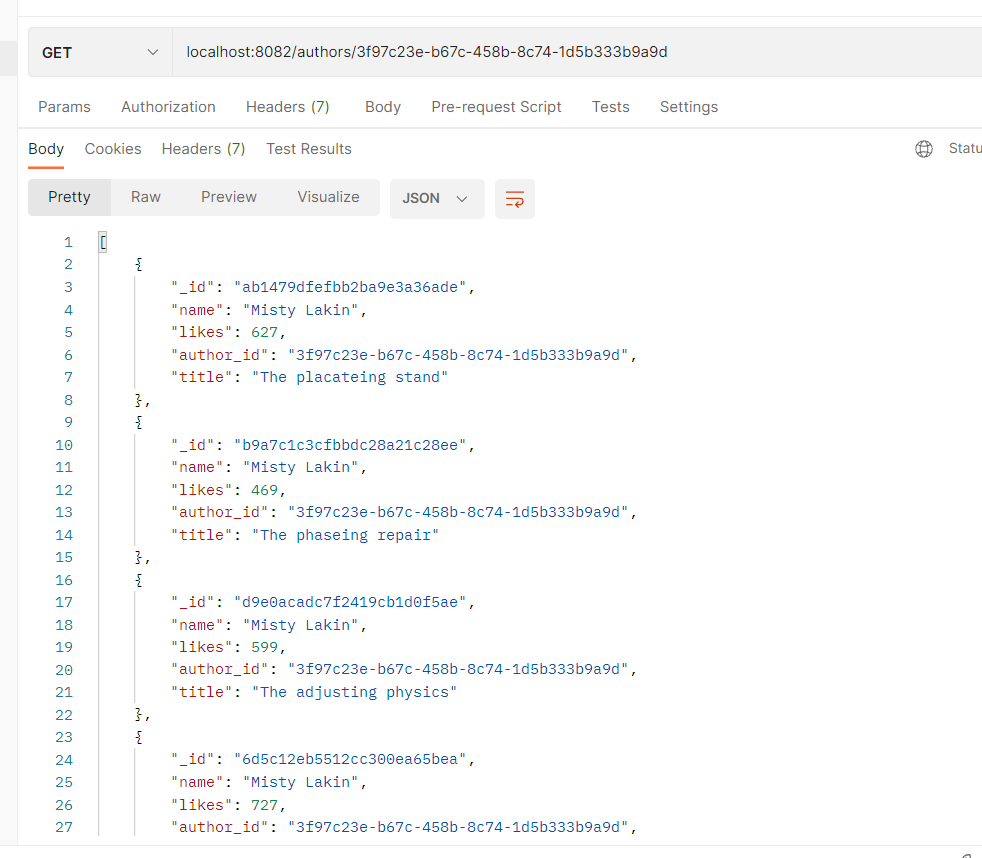
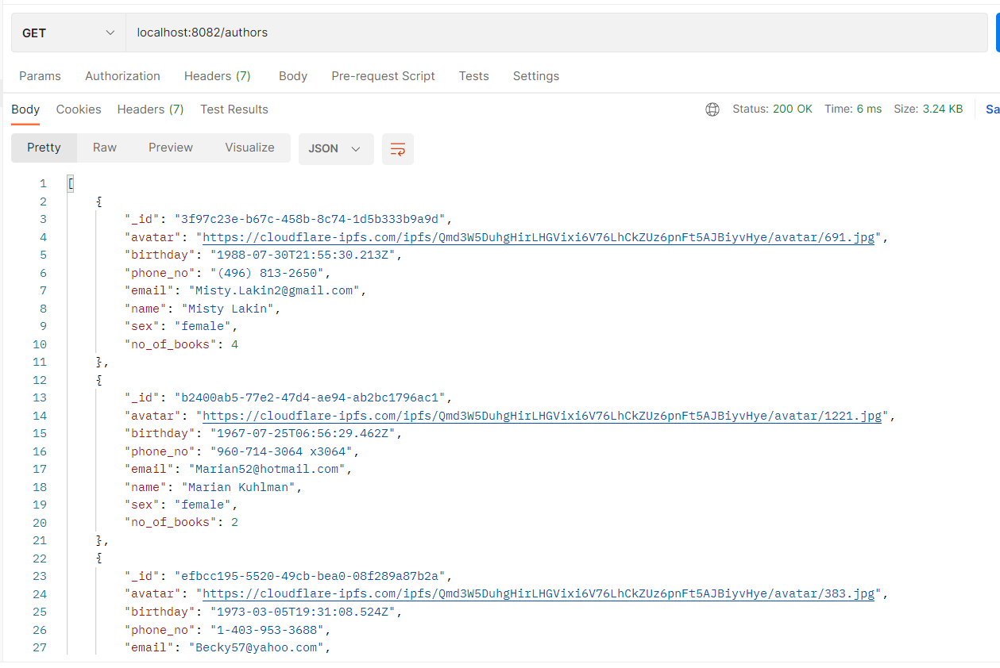
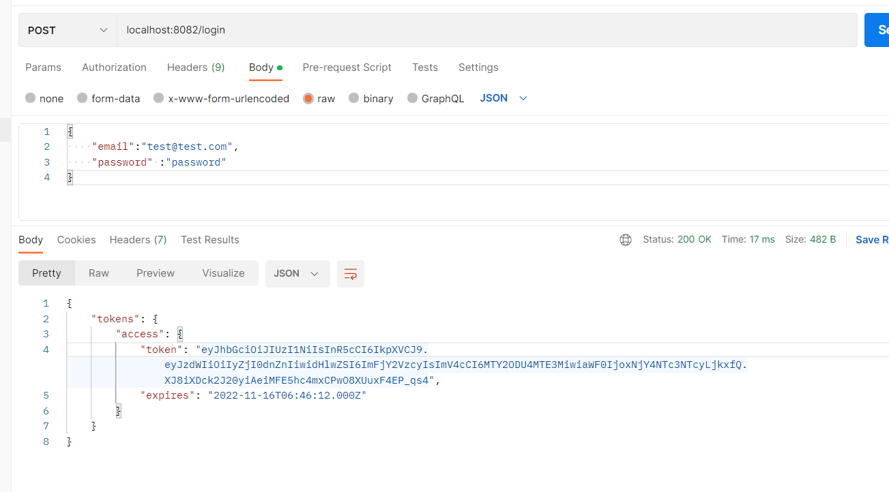
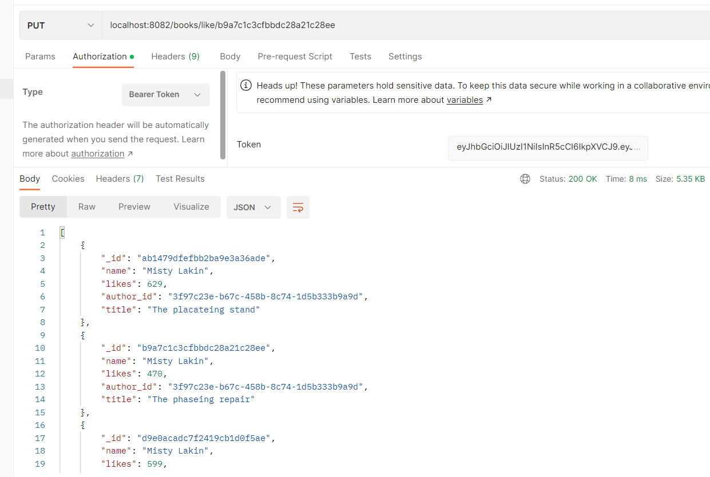
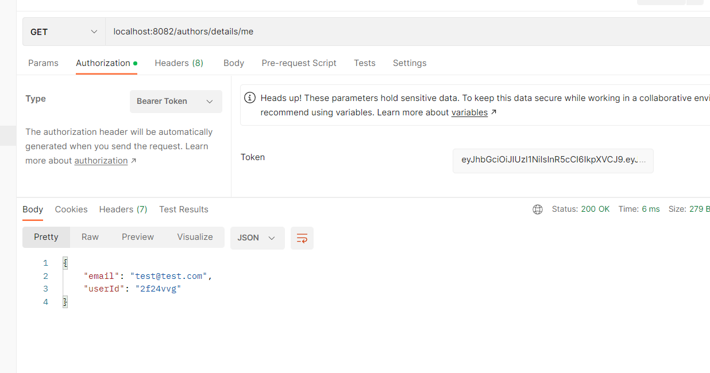

## PET_PERFECT BACKEND ASSIGNMENT

### MODELS:

### 1. Get the list of all books: 
**URL** : localhost:8082/books 

**Output** : 

### 2. GET BOOKS OF SPECIFIC AUTHOR : 
**URL** :  localhost:8082/authors/3f97c23e-b67c-458b-8c74-1d5b333b9a9d

**Output** : 

### 3. GET ALL AUTHORS : 

**URL** : localhost:8082/authors

**Output** : 

### 4. TO LOGIN MAKE POST REQUEST 

**URL** : localhost:8082/login

**Output** : 

### 5. LIKE A BOOK : MAKE PUT REQUEST BY PASSING BEARER TOKEN THAT YOU GOT WHILE LOGGING IN

**URL** : localhost:8082/books/like/b9a7c1c3cfbbdc28a21c28ee

**Output** : 

### 6. GET USER DETAILS : MAKE GET REQUEST WITH BEARER TOKEN 

**URL** : localhost:8082/authors/details/me

**Output** : 

